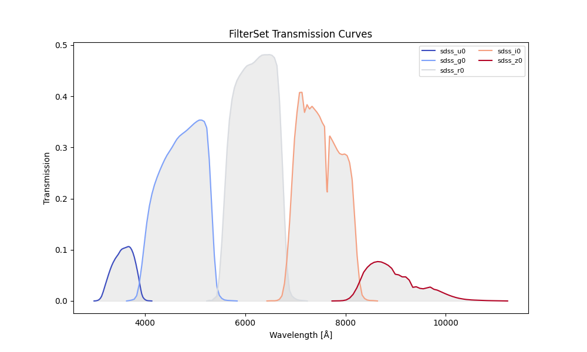
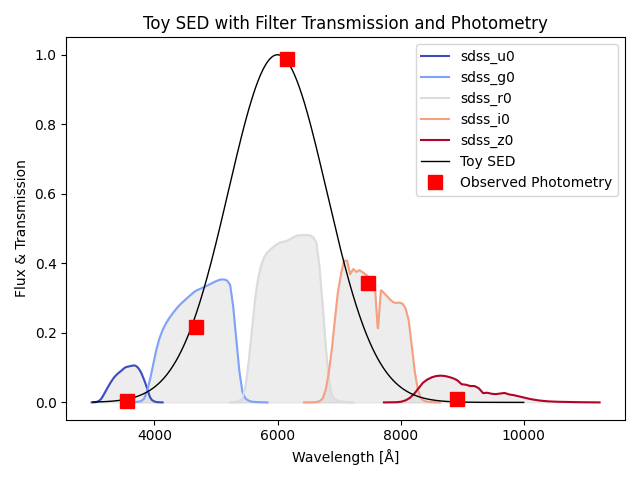

# sedpy_jax

**JAX-accelerated SED fitting tools, filter handling, and broadband photometry projection for astronomy.**

Built as a modern, GPU-ready reimplementation of `sedpy` to support differentiable, scalable spectral energy distribution (SED) fitting — ideal for simulation-based inference, gradient-based samplers (e.g. HMC, NUTS), and high-throughput photometric pipelines.

---

## Features

- Fully JAX-compatible filter operations and broadband projection
- Clean, modular implementation of the `Filter` and `FilterSet` classes
- Easy visualization of filter transmission curves with colormap scaling
- Accurate AB and Vega magnitude computation
- Utility functions for wavelength conversion, rebinning, and interpolation
- Built-in effective wavelength, pivot wavelength, width, and zero-point computation

---

## Installation

### From GitHub (recommended for users)

```bash
pip install git+https://github.com/Espe13/sedpy_jax.git

For development (recommended for contributors)

git clone https://github.com/Espe13/sedpy_jax.git
cd sedpy_jax
pip install -e .
```


## Example: Using FilterSet to Project SEDs

from sedpy_jax.observate import FilterSet
import jax.numpy as jnp
import matplotlib.pyplot as plt

### Load a set of filters
```python
fset = FilterSet(['sdss_u0', 'sdss_g0', 'sdss_r0', 'sdss_i0', 'sdss_z0'])
```
### Plot transmission curves
```python
fset.display(normalize=False, colormap='coolwarm')
plt.show()
```



### Project an SED onto filters
```python
# --- Generate toy spectrum ---
wave = jnp.linspace(3000, 10000, 500)
wave_mask = (wave >= fset.lam.min()) & (wave <= fset.lam.max())
wave = wave[wave_mask]
flux = jnp.exp(-0.5 * ((wave - 6000) / 800)**2)
maggies = fset.get_sed_maggies(flux * 10**-8.5, sourcewave=wave)

# --- Create figure and use shared axis for filters + spectrum ---
fig, ax = plt.subplots()

# Plot transmission curves in background
fset.display(ax=ax)

# Plot toy SED and photometry points
ax.plot(wave, flux, color="black", linewidth=1, label="Toy SED")
ax.plot([f.wave_effective for f in fset.filters], maggies, markersize = 10,
         color="red", marker="s", linestyle="", label="Observed Photometry")

# --- Final touches ---
ax.set_xlabel("Wavelength [Å]")
ax.set_ylabel("Flux & Transmission")
ax.set_title("Toy SED with Filter Transmission and Photometry")
ax.legend()
plt.show()
```




# Table: Filter Properties

```python
print(fset)
```

yields

<pre style="white-space:pre;overflow-x:auto;line-height:normal;font-family:Menlo,'DejaVu Sans Mono',consolas,'Courier New',monospace"><span style="font-style: italic">                  FilterSet Summary                  </span>
┏━━━━━━━┳━━━━━━━━━┳━━━━━━━━━━━┳━━━━━━━━━━━┳━━━━━━━━━┓
┃<span style="font-weight: bold"> Index </span>┃<span style="font-weight: bold"> Name    </span>┃<span style="font-weight: bold"> λ_eff [Å] </span>┃<span style="font-weight: bold"> Width [Å] </span>┃<span style="font-weight: bold"> AB→Vega </span>┃
┡━━━━━━━╇━━━━━━━━━╇━━━━━━━━━━━╇━━━━━━━━━━━╇━━━━━━━━━┩
│ 0     │ sdss_u0 │ 3546.0    │ 558.6     │ -0.9305 │
│ 1     │ sdss_g0 │ 4669.5    │ 1159.9    │ 0.1003  │
│ 2     │ sdss_r0 │ 6155.6    │ 1112.1    │ -0.1423 │
│ 3     │ sdss_i0 │ 7471.5    │ 1070.4    │ -0.3560 │
│ 4     │ sdss_z0 │ 8917.2    │ 1126.8    │ -0.5176 │
└───────┴─────────┴───────────┴───────────┴─────────┘
</pre>

while printing a single filter gives a little more information:

```python
print(fset.filters[0])
```

<pre style="white-space:pre;overflow-x:auto;line-height:normal;font-family:Menlo,'DejaVu Sans Mono',consolas,'Courier New',monospace"><span style="font-style: italic">                               Filter: sdss_u0                                </span>
┏━━━━━━━━━┳━━━━━━━━━━┳━━━━━━━━━━━┳━━━━━━━━━━━━━┳━━━━━━━━━━━┳━━━━━━━━━┳━━━━━━━┓
┃<span style="font-weight: bold"> Name    </span>┃<span style="font-weight: bold"> Nickname </span>┃<span style="font-weight: bold"> λ_eff [Å] </span>┃<span style="font-weight: bold"> Pivot λ [Å] </span>┃<span style="font-weight: bold"> Width [Å] </span>┃<span style="font-weight: bold"> AB→Vega </span>┃<span style="font-weight: bold"> N pts </span>┃
┡━━━━━━━━━╇━━━━━━━━━━╇━━━━━━━━━━━╇━━━━━━━━━━━━━╇━━━━━━━━━━━╇━━━━━━━━━╇━━━━━━━┩
│ sdss_u0 │ sdss_u0  │ 3546.0    │ 3556.5      │ 558.6     │ -0.9305 │ 47    │
└─────────┴──────────┴───────────┴─────────────┴───────────┴─────────┴───────┘
</pre>


# Included Tools

	•	Filter: load and manipulate individual transmission curves
	•	FilterSet: project SEDs across many filters efficiently
	•	air2vac / vac2air: wavelength conversion (Allen/Morton standards)
	•	rebin: flux-conserving rebinning of filters
	•	getSED(): compute AB mags or maggies from source spectra


# Tests

To run tests:

pytest tests/


# Feedback & Contributions

Feel free to open Issues or pull requests.

Created and maintained by Amanda Stoffers (@Espe13)


# License

MIT License. See LICENSE.

⸻

Suggestions
	•	Save an example filter plot as docs/images/filter_transmission_example.png to show off in the README.
	•	Use rich or tabulate in code if you want to generate the property table programmatically.
	•	Add badges (PyPI, Tests, Docs) once you’re ready to publish or CI test.

---

Let me know if you'd like me to generate the actual filter plot or a GitHub Actions testing setup next.